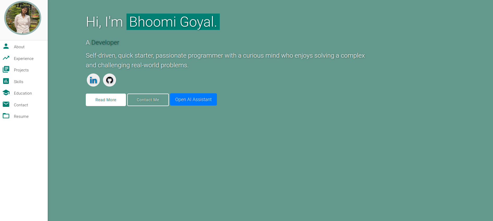
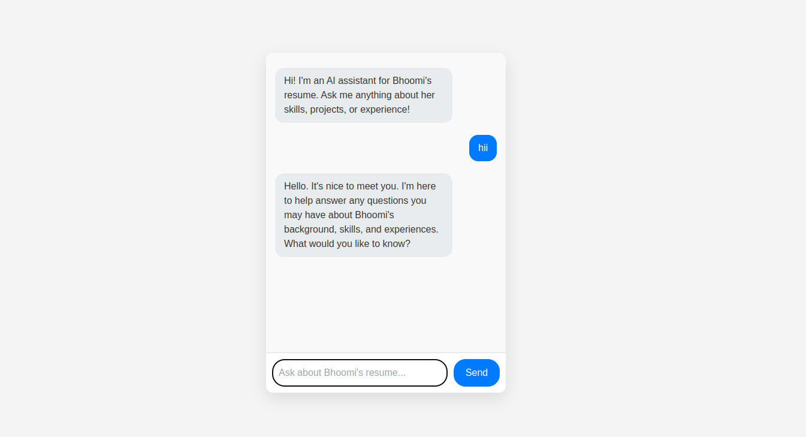

# 🌟 Personal Portfolio - Bhoomi Goyal

A clean, responsive, and elegant personal portfolio template to showcase your skills, projects, experience, and more as a Software Developer!

### 🔗 Live Website
👉 [https://your-username.github.io](https://your-username.github.io) *(Replace after deployment)*

---

## 🔥 Features

- ⚡ Fully Responsive Design
- ⚡ Valid HTML5 & CSS3
- ⚡ Typing animation using Typed.js
- ⚡ Easy to Customize and Extend
- ⚡ Includes Backend (Node.js) Support for Chatbot (Optional)

---

## 🖼️ Preview

| Home Page | Projects Section |
|-----------|------------------|
|  |  |

---

## 🚀 Getting Started

### 1. Clone the Repository

```bash
git clone https://github.com/your-username/your-repo-name.git
cd your-repo-name
